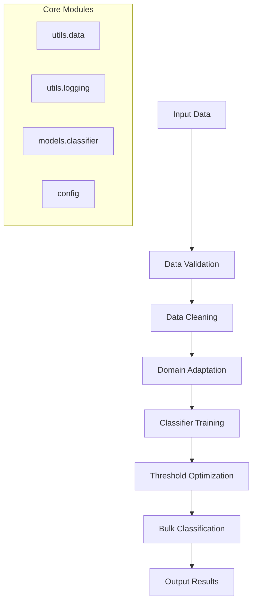

# MTGTag Architecture Overview

## System Architecture

MTGTag is designed as a modular machine learning pipeline with clear separation of concerns and professional software engineering practices.

### High-Level Components



## Package Structure

### `/src/mtgtag/`
Main package containing all source code:

- **`pipeline/`**: Individual pipeline steps as importable modules
  - `diagnose.py`: Tag validation and consistency checking
  - `clean.py`: Data cleaning and tag correction
  - `domain_adapt.py`: Transformer fine-tuning for MTG domain
  - `train.py`: Multi-label classifier training
  - `optimize.py`: Threshold optimization for balanced metrics
  - `classify.py`: Bulk inference pipeline

- **`models/`**: Model classes and ML utilities
  - `classifier.py`: Custom multi-label classifier wrapper
  - Model loading, saving, and inference utilities

- **`utils/`**: Shared utility modules
  - `data.py`: Data loading, validation, and processing
  - `logging.py`: Centralized logging configuration
  - Common helper functions

- **`config.py`**: Centralized configuration management
  - File paths, model parameters, training hyperparameters
  - Environment-specific settings

## Data Flow

### Training Pipeline
1. **Validation** (`diagnose.py`): Check tag consistency against definitions
2. **Cleaning** (`clean.py`): Fix common tag issues and standardize format
3. **Domain Adaptation** (`domain_adapt.py`): Fine-tune base transformer on MTG text
4. **Classification Training** (`train.py`): Train multi-label classifier on clean data
5. **Optimization** (`optimize.py`): Find optimal per-label classification thresholds
6. **Inference** (`classify.py`): Apply trained models to full card database

### Inference Pipeline
1. Load pre-trained domain-adapted model and classifier
2. Load optimized thresholds (if available)
3. Process input cards through tokenization
4. Generate probability predictions
5. Apply thresholds to produce binary classifications
6. Format and save results

## Model Architecture

### Domain-Adapted Transformer
- **Base Model**: DistilBERT (lightweight, fast inference)
- **Fine-tuning**: Continued pre-training on MTG card text corpus
- **Purpose**: Learn domain-specific representations of MTG terminology

### Multi-Label Classifier
- **Architecture**: Transformer encoder + linear classification head
- **Output**: 72-dimensional probability vector (one per tag)
- **Loss Function**: Binary cross-entropy (multi-label setting)
- **Post-processing**: Per-label optimized thresholds

## Configuration Management

The system uses a centralized configuration approach:

```python
# config.py
PROJECT_ROOT = Path(__file__).parent.parent.parent
DATA_DIR = PROJECT_ROOT / "data"
MODELS_DIR = PROJECT_ROOT / "models"

DEFAULT_CONFIG = {
    "domain_adaptation": {...},
    "classifier_training": {...},
    "threshold_optimization": {...}
}
```

## Logging Strategy

Structured logging throughout the pipeline:
- **Console output**: INFO level for user feedback
- **File logging**: DEBUG level for detailed debugging
- **Consistent formatting**: Timestamps, module names, log levels
- **Error handling**: Graceful failure with informative messages

## CLI Interface Design

Each pipeline step is exposed as a command-line tool:
- **Consistent argument parsing**: Using argparse with help text
- **Flexible configuration**: Override defaults via command-line flags
- **Progress feedback**: Real-time status updates and completion messages
- **Error handling**: Clear error messages and exit codes

## Extension Points

The architecture supports easy extension:

1. **New Pipeline Steps**: Add modules to `pipeline/` directory
2. **Custom Models**: Implement new model classes in `models/`
3. **Additional Utilities**: Extend `utils/` with new helper functions
4. **Configuration**: Add new parameters to `config.py`

## Performance Considerations

- **Memory Management**: Batch processing for large datasets
- **GPU Utilization**: Automatic device detection and usage
- **Caching**: Model and data caching where appropriate
- **Scalability**: Designed for processing 25,000+ cards efficiently

## Quality Assurance

- **Type Hints**: Throughout codebase for better IDE support
- **Error Handling**: Comprehensive exception handling
- **Logging**: Detailed logging for debugging and monitoring
- **Validation**: Input validation and sanity checks
- **Testing**: Structure supports unit and integration testing